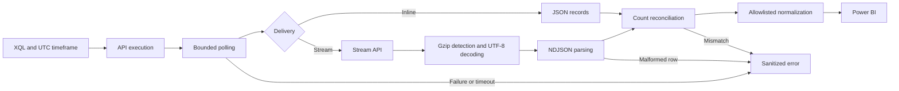

# XSIAM Analytics Connector

**Analytics Engineering portfolio · API integration · Cybersecurity analytics · AI-assisted engineering**

A source-level Power Query M reference implementation that turns asynchronous XQL query results into a stable, typed table for Power BI. An offline synthetic demo is included; no tenant or credentials are needed to explore it.

## Problem and objective

Security analytics APIs do not always return a table in one request. A query must be started, polled to completion, and resolved through inline JSON or a streamed result payload. Schema variation and malformed rows can silently undermine reporting.

This project demonstrates how to separate those responsibilities, preserve execution scope, detect incomplete results, and publish a deliberately small data contract. It is a portfolio prototype, not a certified connector or a production deployment.

## Engineering evidence and AI positioning

This project supports my AI Analytics Engineer portfolio through concrete work in API orchestration, data contracts, defensive parsing, synthetic validation and security-aware data delivery. These are relevant foundations for Applied AI and AI-Native Data Products.

**The implementation contains no model inference, agents, embeddings, RAG or AI-generated analytics.** AI-assisted engineering describes assistance with the public reconstruction, documentation and review process. It does not describe runtime functionality, prove autonomous engineering or establish production results. Technical choices remain subject to human review.

## Architecture



The transport is injected into the core. The demo and M tests use synthetic transports; the optional live adapter uses a fixed HTTPS origin and three allowlisted API paths. Both delivery branches use the same normalization function. Diagnostics contain counts and delivery mode only.

## Try the offline demo

1. In Power BI Desktop, open **Transform data → New source → Blank query**.
2. Name the query `Connector`. Paste [src/Connector.pq](src/Connector.pq) into Advanced Editor.
3. Create `DemoIssues` and paste [examples/DemoIssues.pq](examples/DemoIssues.pq).
4. Load `DemoIssues`. Expect two synthetic rows, sorted newest first: `SYNTH-002`, then `SYNTH-001`.
5. For model use, convert `event_time_utc` to Date/Time only after retaining its UTC meaning in the column name. Keep `issue_id` as text.
6. Create `ContractTests` using [tests/ContractTests.pq](tests/ContractTests.pq). All 25 rows should have `Passed = true`; otherwise the query raises an error.

The functions and tests are supplied as M source, not a `.mez` extension. Runtime checks in Power BI remain pending; see [validation status](docs/validation.md).

## Project structure

```text
src/Connector.pq          Pure transformations and injected orchestration
src/LiveTransport.pq      Optional HTTPS adapter
config/Config.example.pq  Nonfunctional placeholders and bounded query
examples/DemoIssues.pq    Offline Power BI entry point
examples/LiveIssues.pq    Opt-in live Power BI entry point
examples/issues.ndjson   Entirely synthetic input
tests/ContractTests.pq    Tests of actual M functions, no network
scripts/validate.mjs      Offline artifact checks (not an M evaluator)
docs/architecture.md     Contract, design decisions and trade-offs
docs/security.md         Publication boundaries and live-data risks
docs/validation.md       Evidence, expected results and remaining checks
LICENSE                  MIT
```

## Live configuration

Only after reviewing [security considerations](docs/security.md), create queries named `LiveTransport` and `Config` from the corresponding source files. Replace the placeholders inside a private local Power BI file. Then create `LiveIssues` from its example.

| Setting | Published value | Meaning |
| --- | --- | --- |
| BaseUrl | `https://tenant.example.invalid` | Replace with an approved HTTPS tenant API origin |
| ApiKey | `<API_KEY>` | Locally configured standard API key |
| ApiKeyId | `<API_KEY_ID>` | Locally configured authentication ID |
| LookbackHours | `24` | UTC execution window |
| MaxAttempts | `12` | Maximum polling requests |
| WaitSeconds | `5` | Delay between pending responses |

The example XQL selects only the six projected fields and limits the result to 100 rows. Adapt the query and schema together in an authorized environment. The limit makes this a sample, not an exhaustive security inventory. Configuration placeholders deliberately cannot authenticate.

Power Query parameters are not a secret store. Do not distribute configured PBIX/PBIT files. This standard-key header adapter may require Anonymous authentication at the Power Query Web source level; the API request itself carries authentication. Advanced-key signing, scheduled refresh and gateway deployment are not implemented or validated.

## Validation approach

Run `node scripts/validate.mjs` from the repository root for fixture, link, publication-boundary and artifact checks. Run `ContractTests` in Power Query for M behavior. Complete the separate authorized live checklist before making runtime or operational claims. No production performance, deployment, refresh reliability or business-impact metrics are asserted.

## Scope and trade-offs

Strict parsing and row-count reconciliation prevent silent partial success. A six-column allowlist makes schema drift explicit but limits dataset coverage. Stream download is buffered in memory, not a constant-memory iterator. Bounded polling makes refresh cost more predictable but can time out on long queries. There is no durable job state, automatic start-query retry, pagination/window partitioning or incremental refresh. [Architecture and decisions](docs/architecture.md) explains the consequences.

## License

MIT; see [LICENSE](LICENSE). Cortex XSIAM and Power BI are third-party products. This project is independent and is not endorsed by their vendors.
